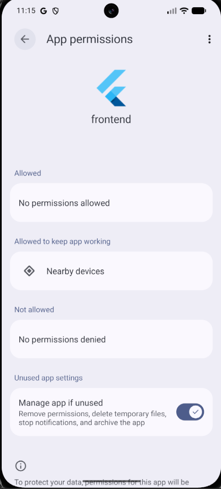
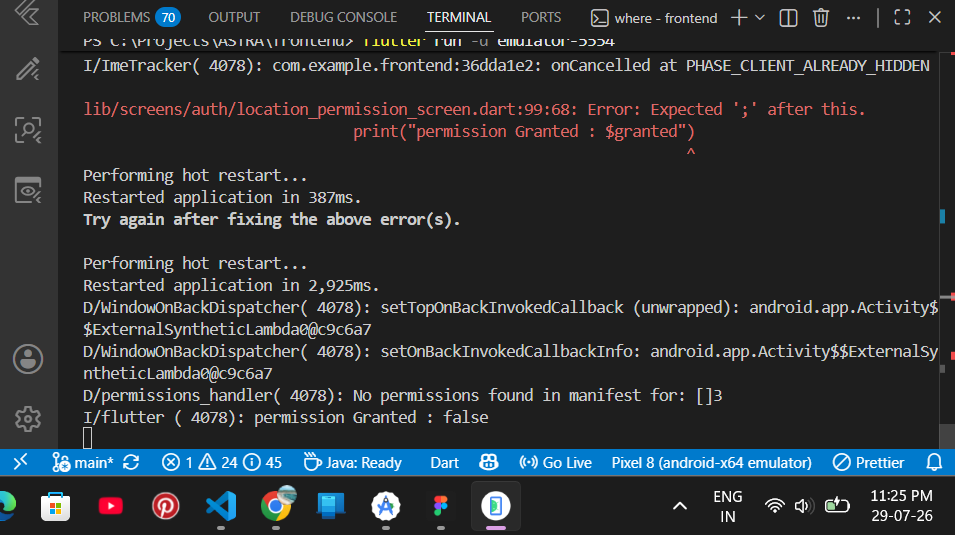
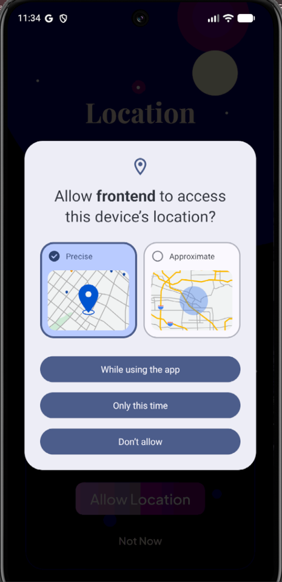
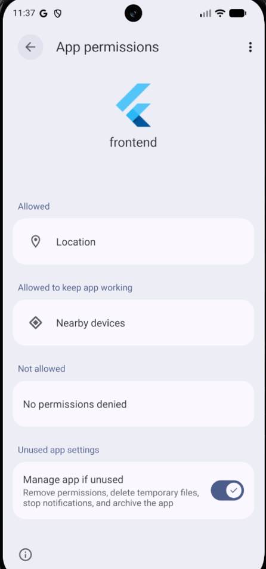

# 📍 Android Location Permission Popup Not Showing

## Challenge Category

DEV Summer Bug Smash – Clear the Lineup

---

# Project Overview

**Project Name:** ASTRA – One Step Ahead

ASTRA is a Flutter-based AI-powered personal safety application designed to help users stay safe during their journeys. Before a journey starts, the application requests the user's current location permission because features like live tracking, guardian location sharing, AI safety analysis, and emergency SOS depend on access to the device's location.

The location permission screen is one of the first mandatory steps during onboarding. Without granting location access, users cannot continue using ASTRA's core safety features.

## Environment

Flutter 3.44.6

Android Emulator

permission_handler package

Android SDK 35

## References

Flutter permission_handler documentation

Android Runtime Permissions documentation

---

# Objective

The goal of this module was simple:

When the user presses the **Allow Location** button, Android should display the native location permission popup.

After the user grants permission, the application should navigate to the next setup screen.

---

# Bug Description

This is one of the most important features of ASTRA because live location tracking is the foundation of the application's safety system.

While testing the application on Android, pressing the **Allow Location** button did not display any operating system permission popup.

Instead of showing the Android location permission dialog, the request failed immediately.

Because of this:

- Users never received a location permission request.
- Location access remained unavailable.
- The onboarding flow could not continue correctly.
- ASTRA's journey tracking features became unusable because location permission is mandatory.

---

# Expected Behaviour

After pressing **Allow Location**:

1. Android should display its native location permission popup.
2. The user should be able to Allow or Deny permission.
3. The application should continue according to the user's choice.
4. Navigate to the next screen.

---

# Actual Behaviour

Pressing **Allow Location** resulted in no Android permission popup appearing.

The application reported that no location permissions were available, preventing the permission request from reaching the operating system.

---

# Investigation Process

The debugging process was carried out step by step instead of assuming the problem was inside the Flutter code.

The following areas were investigated:

- Verified that the `permission_handler` package was correctly integrated.
- Checked whether the location request function was actually being executed.
- Confirmed that the button correctly triggered the permission request.
- Reviewed Android configuration files.
- Compared the application's Android setup with the official permission requirements.

During this investigation, it became clear that Flutter was requesting a permission that Android had never been told the application intended to use.

---

# Root Cause

The required Android location permissions were missing from the application's `AndroidManifest.xml` file.

Since Android only allows runtime permission requests for permissions declared in the manifest, the operating system ignored the request completely.

As a result, no location permission popup was displayed to the user.

---

# Files Modified

```
frontend/android/app/src/main/AndroidManifest.xml
```

---

# Solution

The required location permissions were added to the Android manifest.

```xml
<uses-permission android:name="android.permission.ACCESS_FINE_LOCATION"/>

<uses-permission android:name="android.permission.ACCESS_COARSE_LOCATION"/>
```

Once these permissions were declared, Android recognized that the application was allowed to request location access at runtime.

---

# Result

After adding the required permissions:

- ✅ Android displayed the native location permission popup.
- ✅ Users could grant or deny location permission.
- ✅ The onboarding flow continued normally.
- ✅ ASTRA's location-based features became functional.

---

# Technical Improvement

This fix restored one of the application's most important onboarding steps.

Instead of allowing the application to silently fail before journey tracking even began, ASTRA now correctly requests location permission using Android's standard permission flow.

The fix also improves reliability because future location-based modules will now operate on a correctly configured Android permission system.

---

# Lessons Learned

This debugging process reinforced an important Android development principle:

Flutter packages alone are not sufficient for requesting runtime permissions.

Every permission requested by the application must first be declared inside `AndroidManifest.xml`. Without those declarations, Android will never display the operating system permission dialog regardless of how correct the Flutter code is.

Always verify the Android manifest before assuming the issue exists inside the Flutter application logic.

---

# Git Commit

## Commit Message

```text
feat: update ASTRA with location permission, services and documentation
```

## Commit Link

```
https://github.com/dhairyagugale7-tech/ASTRA-One-Step-Ahead/commit/57f6a23054264dd72a6bba8b6877bffad94e67bc

```
## Commit Summary

This commit includes the implementation of the Android location permission fix by adding the required permissions to the `AndroidManifest.xml`, updating the permission request flow, and documenting the complete debugging process with supporting screenshots. Since this was part of an active development session, the commit also contains additional project improvements made alongside the bug fix.

---

# Screenshots 

1. Initial Problem

Before debugging, Android Settings showed that the application had no Location permission available. This confirmed that the operating system was not recognizing any location permission for the application.



2. Error Investigation

While testing the permission flow, Logcat reported the following message:

No permissions found in manifest

This indicated that the operating system could not find the required location permissions inside AndroidManifest.xml.



3. Successful Permission Request

After updating the Android manifest, the application successfully triggered Android's native permission dialog.

The user could now choose:

Precise Location
Approximate Location
While using the app
Only this time
Don't allow



4. Final Verification

Finally, Android Settings confirmed that Location now appeared under the application's allowed permissions, proving that the issue had been resolved successfully.



# Conclusion

This bug demonstrated that not every runtime permission issue originates from Flutter code.

Although the permission request logic was implemented correctly, Android refused to display the permission dialog because the required permissions were missing from the platform configuration.

By investigating the issue step by step instead of making assumptions, the root cause was identified quickly and resolved with a small but critical configuration change.

This fix restored one of ASTRA's core onboarding features and ensured that every location-based module in the application could function as intended.

More importantly, it reinforced the importance of validating platform-specific configuration whenever working with Flutter plugins that interact with native Android features.

# Why This Bug Matters

This was not just a visual or UI issue.

Location permission is the foundation of ASTRA's safety features.

Without it:

- Live location sharing cannot function.
- Guardian tracking cannot begin.
- AI safety analysis cannot access user location.
- Journey monitoring becomes impossible.

Resolving this issue ensured that the application's most important functionality could operate as designed.